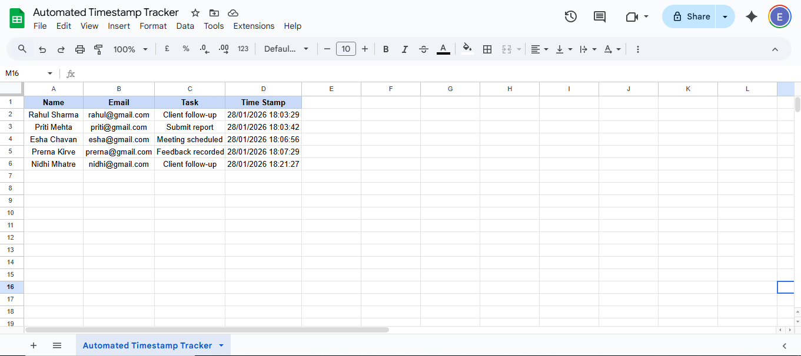

# Automated Data Entry & Timestamp Tracker

# Overview
A Google Sheets automation project that automatically records a timestamp when a task is entered, ensuring accurate tracking and data integrity.

# Tools Used
- Google Sheets
- Google Apps Script (JavaScript)

# How It Works
1. User enters a task in the Task column
2. Script detects the edit using `onEdit`
3. Timestamp is added automatically
4. Timestamp does not change on further edits

# Preview

# Use Case
Useful for task tracking, audit logs, attendance registers and compliance documentation.

# What I Learned
- Apps Script triggers
- Sheet automation
- Preventing manual errors
